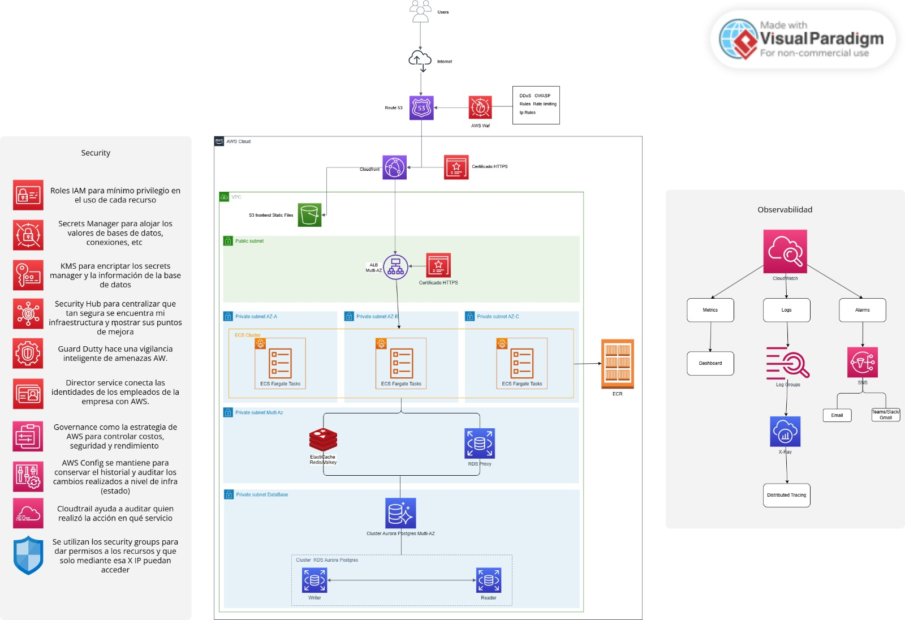

<h1 align="center">Diagrama arquitectura JFC test Pragma</h1>



# 🛒 JFC E-commerce – AWS CloudOps

## 📋 Descripción

Se diseñó una arquitectura AWS moderna para soportar la aplicación de e-commerce de JFC, enfocada en **escalabilidad, alta disponibilidad, seguridad, rendimiento, observabilidad y optimización de costos**.

La solución utiliza servicios administrados y serverless para reducir la gestión manual de infraestructura y permitir que la plataforma se adapte automáticamente a cambios en la demanda.

---

## 🏗️ Arquitectura

El flujo principal de la aplicación es:

```text
Usuario
   │
   ▼
Internet
   │
   ▼
Route 53
   │
   ▼
AWS WAF
   │
   ▼
CloudFront
   │
   ├──────────────► S3
   │                 │
   │                 └── Frontend
   │
   ▼
Application Load Balancer
   │
   ▼
ECS Fargate
   │
   ├──────────────► ElastiCache Redis
   │
   └──────────────► RDS Proxy
                       │
                       ▼
                  Aurora PostgreSQL
```

La aplicación se despliega en múltiples **Availability Zones**, evitando puntos únicos de falla y mejorando la disponibilidad de la plataforma.

---

## 📈 Escalabilidad y rendimiento

- 🚀 **ECS Fargate** ejecuta los microservicios sin necesidad de administrar servidores.
- ⚖️ **Application Load Balancer** distribuye el tráfico entre las tareas disponibles.
- 📊 **Auto Scaling** aumenta o reduce automáticamente la capacidad según la demanda.
- 🗄️ **Aurora Serverless v2** ajusta dinámicamente la capacidad de la base de datos.
- ⚡ **ElastiCache Redis** reduce la latencia y la carga sobre Aurora.
- 🌎 **CloudFront** permite distribuir contenido desde ubicaciones cercanas a los usuarios.
- ⚙️ Los límites de capacidad se parametrizan según cada ambiente.

---

## 🔐 Seguridad

La arquitectura implementa un modelo de **defensa en profundidad** mediante:

| Servicio | Responsabilidad |
|---|---|
| 🛡️ AWS WAF | Protección de la aplicación web |
| 🔑 IAM | Control de acceso y mínimo privilegio |
| 🔒 Secrets Manager | Gestión segura de credenciales y secretos |
| 🔐 KMS | Cifrado y gestión de claves |
| 🦺 Security Groups | Gestión de entrada a los diferentes servicios |
| 📋 CloudTrail | Auditoría de operaciones |
| 🕵️ GuardDuty | Detección de amenazas |
| 🛡️ Security Hub | Centralización de hallazgos de seguridad |
| ⚙️ AWS Config | Evaluación de configuración y compliance |
| 🎮 Governance | Estrategia de control total sobre los ambientes y sus diferentes acciones |
| 🕵🏼‍♂️ Director Service | Conexión de identidad de cada usuario entrante a cada ambiente |

Los componentes de aplicación y base de datos se mantienen en **subredes privadas**, limitando su exposición directa a Internet.

---

## 📊 Observabilidad y operación

**Amazon CloudWatch** centraliza métricas, logs, dashboards y alarmas de los principales componentes de la plataforma.

Se monitorean indicadores como:

- CPU y memoria.
- Latencia.
- Errores HTTP 4xx/5xx.
- Estado de tareas ECS.
- Health de los targets del ALB.
- Métricas de Aurora.
- Métricas de ElastiCache.
- Tráfico y solicitudes bloqueadas por WAF.

Las alarmas permiten detectar problemas de forma preventiva y notificar al equipo mediante **Amazon SNS**.
---

## ☁️ Infrastructure as Code

Toda la infraestructura se implementa mediante **AWS CloudFormation**, utilizando templates separados por responsabilidad y parámetros independientes para:

DEV
QA
PDN

Los despliegues se automatizan mediante Azure DevOps Pipelines, incluyendo validación, publicación de templates, despliegue progresivo y aprobación antes de producción
Esto permite reutilizar los mismos templates para **DEV, QA y PDN**, modificando únicamente los parámetros correspondientes dentro de las librerías (Se coloca una especie de MOCK ya que no se tiene acceso a crear por ahora una librerías a nivel interno del repositorio).

---

## 🚀 CI/CD

El despliegue de la infraestructura se automatiza mediante **Azure DevOps Pipelines**.

```text
Git Trigger (main)
 │
 ▼
Stage: Validar (Linter)
 │
 ├── cfn-lint (Sintaxis Profunda)
 └── aws cloudformation validate-template (Sintaxis Base)
 │
 ▼
Stage: Desplegar DEV (jfc-development env)
 │  (Despliegue modular secuencial:
 │   Red -> KMS -> ECR -> ECS -> RDS -> Proxy)
 │
 ▼
Stage: Desplegar QA (jfc-qa env)
 │  (Despliegue modular secuencial)
 │
 ▼
Verificación: Aprobación Manual (jfc-production env)
 │  (Persona 'x' debe aprobar para continuar)
 │
 ▼
Stage: Desplegar PDN (jfc-production env)
    (Despliegue modular secuencial)
```

El proceso permite mantener despliegues reproducibles, controlados y auditables, reduciendo errores derivados de configuraciones manuales.

---

## 💰 Optimización de costos

La arquitectura prioriza servicios administrados y modelos de consumo variable para evitar sobredimensionar permanentemente la infraestructura.

Principales estrategias:

- **ECS Fargate** para evitar administrar servidores.
- **Auto Scaling** para ajustar capacidad según demanda.
- **Aurora Serverless v2** para ajustar capacidad de base de datos.
- **CloudFront** para reducir tráfico hacia los orígenes.
- **ElastiCache** para disminuir consultas repetitivas.
- Diferentes capacidades para DEV, QA y PDN.
- Monitoreo de utilización y costos.

La estimación final se encontrará en un apróximado dentro del [Costos](costbilling.md) y así visualizar un aproximado de usuarios activos diarios.

---

## ✅ Resultado

| Objetivo | Implementación |
|---|---|
| 📈 Escalabilidad | ECS Fargate + Auto Scaling + Aurora Serverless |
| 🟢 Alta disponibilidad | Multi-AZ + ALB + ECS + Aurora |
| ⚡ Rendimiento | CloudFront + Redis + Fargate + RDS Proxy |
| 🔐 Seguridad | WAF + IAM + KMS + Secrets Manager |
| 📊 Observabilidad | CloudWatch + CloudTrail + X-Ray |
| 🤖 Automatización | Lambda + EventBridge + Systems Manager |
| 🏗️ IaC | AWS CloudFormation |
| 🔄 CI/CD | Azure DevOps Pipelines |
| 💰 Costos | Serverless + Auto Scaling + monitoreo |

> **Resultado:** una infraestructura AWS escalable, altamente disponible, segura, observable y automatizada, preparada para soportar variaciones importantes de tráfico manteniendo bajo control la complejidad operativa y los costos.
